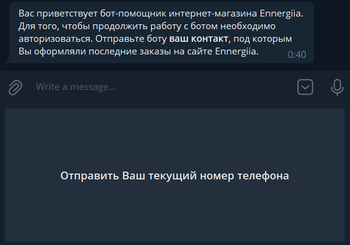
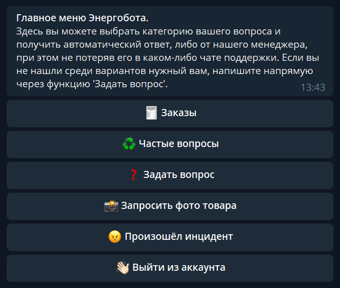
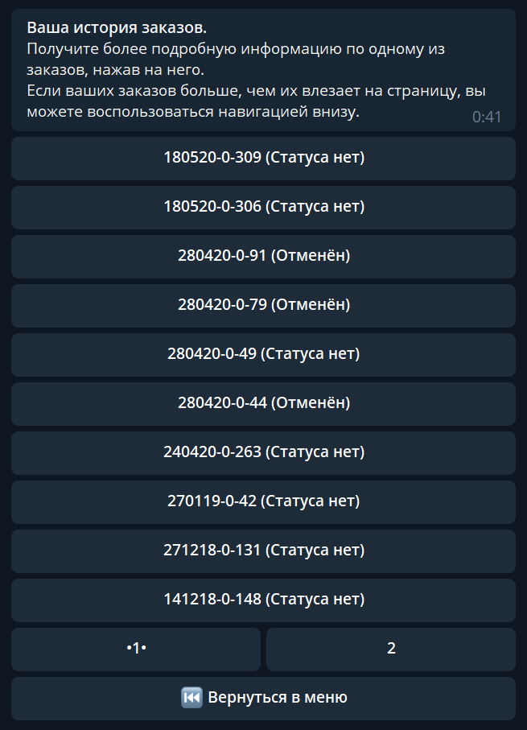
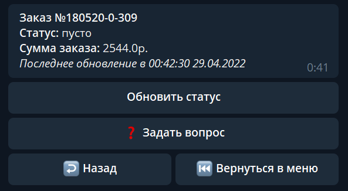
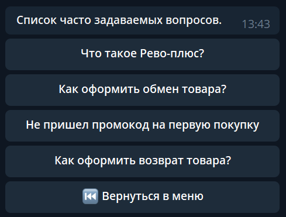
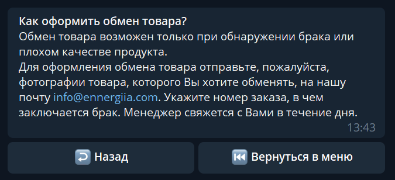

# Сервис бота поддержки в Telegram.
### Кусок кода из моего рабочего проекта. Убрал всю чувствительную информацию, конфиги и подобное.

Для общения с API Telegram используется pyTelegramBotAPI.

---
## Приложение `bot_user`

### Сама логика бота построена на мной написанной state-машине.

Это позволяет отслеживать состояние переходов пользователя в боте. 
То, в каких меню он находится, на какие кнопки может нажимать, какой текст ему будет присылаться.
А также исключает возможность некорректных вводов и действий, 
которые недоступны в текущем состоянии пользователя.

 

### Как разобраться в коде

Сам класс StateMachine описан в `utils.bot` (line 194). 
Инициализируется в `apps.bot_user.routes` (line 32). 
`callback_behavior` описывает возможные действия по состояниям при получении callback-вызовов от Telegram. 
`message_behavior` описывает возможные действия по состояниям при получении пользовательских сообщений.

Структура, описывающая состояние и возможные ветвления из него: 

    Состояние.название_состояние: [
        ("^регулярное_выражение_соответствующее_данному_функционалу$", необходимая_функция_без_вызова),
        ...
    ],

Соединение с ботов инициализируется в `apps.bot_user.handlers` (line 25). 
При этом класс работы с ботом наследован от `telebot.TeleBot` и переопределён по ряду функций. 
Например, добавлено кэширование состояний пользователя для того, чтобы реализовать "хлебные крошки" 
и возможность возвращаться к предыдущей странице как по вертикальной вложенности, так и по горизонтальному пути переходов.

 

### Функционал бота

1. Возможность залогиниться по своему номеру. 
   Происходит авторизация с проверкой существования пользователя в системе и получение его токена. 
   При том, есть два типа пользователей, и дальнейший текст, поведение меню "Заказы" будет отличаться для этих типов. 
   Для безопасности, допускается использовать только номер, привязанный к Telegram-аккаунту.
   Присылается отдельной кнопкой, не принимает ввод от руки.
   
   

2. После авторизации пользователь попадает в главное меню бота.
   
   

3. При переходе в "Заказы" пользователю открывается список его заказов,
   по которому он может переходить, смотреть состояние заказа. 
   Есть пагинация, вмещающая множество страниц и удобное переключение между ними.
   
   

4. Информация по заказу. Статус, если имеется, сумма и время последнего обновления. 
   Из меню доступно запросить обновление данных по заказу, а также перейти в диалог со службой поддержки. 
   А также переход назад в список заказов с сохранением прогресса пагинации и кнопка возвращения в главное меню.
   
   

5. Блок частые вопросы имеет динамическую сборку и не прописывается явно в `routes`. 
   Меню основано на данных таблицы FAQ, которой можно управлять в админской панели приложения. 
   Добавление/удаление записей из этой таблицы меняет наполнение FAQ-меню в боте. Как и смена порядка записей.
   
   
   

6. Задать вопрос.
   

7. Запросить фото товара.
   

8. Создать инцидент/жалобу. Ещё более сложный и интересный способ динамической реализации меню бота, чем в FAQ. 
   Наполнение, поведение состояний, глубина переходов полностью контролируются через админскую панель. 
   Реализовано благодаря `MenuNode` и библиотеке `django-mptt`,
   позволяющей создавать модели, с которыми можно работать как с деревьями.
   

9. Выйти из аккаунта.

---
## Приложение `support`

Приложение позволяет хранить и передавать сообщения от клиента в службу поддержки и обратно.
А также обмен сообщений со складом.

Сообщения менеджерам отправлялись в сервис Blinger, который агрегирует сообщения из всех соцсетей и, в том числе, из моего бота.
Ответы пользователям приходят на Webhook `v1/blinger/webhook/`.