# Сервис бота поддержки в Telegram.
### Кусок кода из моего рабочего проекта. Убрал всю чувствительную информацию, конфиги и подобное.

Для общения с API Telegram используется pyTelegramBotAPI.

---
## Приложение `bot_user`

### Сама логика бота построена на мной написанной state-машине.

Это позволяет отслеживать состояние переходов пользователя в боте. 
То, в каких меню он находится, на какие кнопки может нажимать, какой текст ему будет присылаться.
А также исключает возможность некорректных вводов и действий, 
которые недоступны в текущем состоянии пользователя.

 

### Как разобраться в коде

* Сам класс StateMachine описан в `utils.bot` (line 194). 
Инициализируется в `apps.bot_user.routes` (line 32). 
   * `callback_behavior` описывает возможные действия по состояниям при получении callback-вызовов от Telegram. 
   * `message_behavior` описывает возможные действия по состояниям при получении пользовательских сообщений.

* Структура, описывающая состояние и возможные ветвления из него: 

    Состояние.название_состояние: [
        ("^регулярное_выражение_соответствующее_данному_функционалу$", необходимая_функция_без_вызова),
        ...
    ],

* Соединение с ботом инициализируется в `apps.bot_user.handlers` (line 25). 
При этом класс работы с ботом наследован от `telebot.TeleBot` и переопределён по ряду функций. 
   * Например, добавлено кэширование состояний пользователя для того, чтобы реализовать "хлебные крошки" 
и возможность возвращаться к предыдущей странице как по вертикальной вложенности, так и по горизонтальному пути переходов.
   * Удаление предыдущих сообщений от бота при текстовом вводе от пользователя, 
     чтобы inline-клавиатура у пользователя была только в одном, самом последнем сообщении. 
     И чтобы не было коллизий, когда пользователь видит одновременно несколько меню, соответствующих разным состояниям.

 

### Функционал бота

#### 1. Возможность залогиниться по своему номеру. 
   Происходит авторизация с проверкой существования пользователя в системе и получение его токена. 
   При том, есть два типа пользователей, и дальнейший текст, поведение меню "Заказы" будет отличаться для этих типов. 
   Для безопасности, допускается использовать только номер, привязанный к Telegram-аккаунту.
   Присылается отдельной кнопкой, не принимает ввод от руки.

   

 

#### 2. После авторизации пользователь попадает в главное меню бота. 

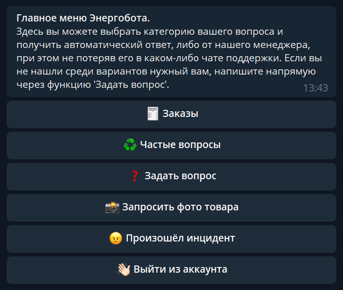

 

#### 3. Пользователь может смотреть свои "Заказы" из личного кабинета сайта.
   При переходе в "Заказы" пользователю открывается список его заказов,
   по которому он может переходить, смотреть состояние заказа. 
   Есть пагинация, вмещающая множество страниц и имеющая удобное переключение между страницами.

   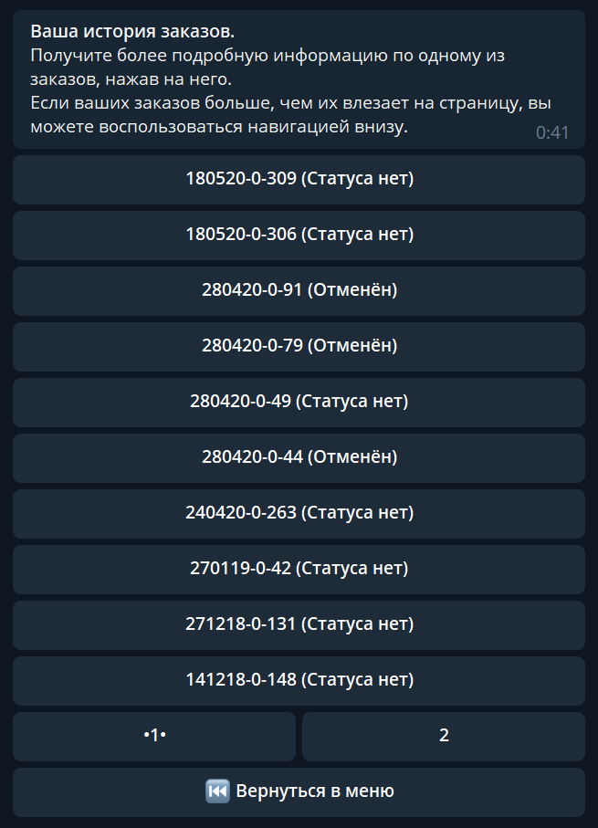

 

#### 4. Информация по заказу. Статус, если имеется, сумма и время последнего обновления. 
   Из меню доступно запросить обновление данных по заказу, а также перейти в диалог со службой поддержки. 
   А также переход назад в список заказов с сохранением прогресса пагинации и кнопка возвращения в главное меню.

   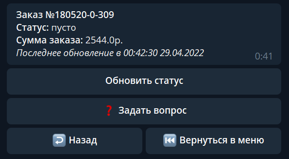

 

#### 5. Блок частые вопросы имеет динамическую сборку и не прописывается явно в `routes`. 
   Меню основано на данных таблицы FAQ, которой можно управлять в админской панели приложения. 
   Добавление/удаление записей из этой таблицы меняет наполнение FAQ-меню в боте. Как и смена порядка записей.

   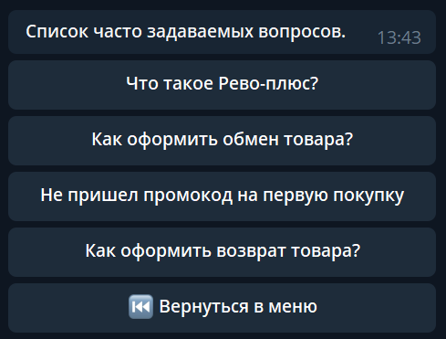
   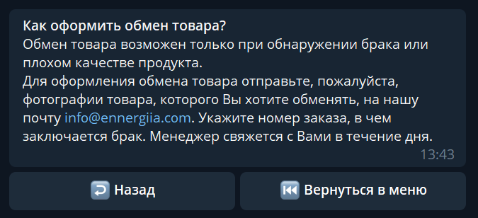

 

#### 6. Задать вопрос.
   Пользователь может обратиться в службу поддержки магазина и задать интересующий вопрос.
   До менеджеров оно доходило через Blinger.
   В чат поддержки можно попасть как из главного меню, так и из карточки заказа.
   В этом случае, менеджеру также передаётся контекст: из карточки какого заказа пишет пользователь.
   Это помогает отвечать на вопросы по типу "почему заказ до сих пор не доставлен?",
   т.к. менеджер видит о каком заказе идёт речь, даже если пользователь не уточнил.

   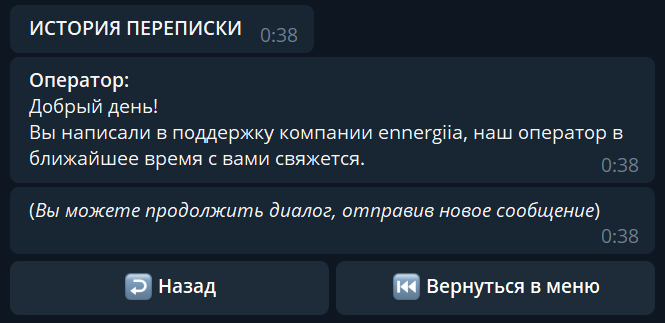

 

#### 7. Запросить фото товара со склада.
   Передача запросов пользователя бота в чат склада в Telegram, где работники, 
   используя стандартную функцию ответа на сообщение в Telegram, могли напрямую ответить пользователю и передать как текст, так и фото.
   Сообщения сразу реадрессовались пользователю через бота, сохраняя анонимность сотрудников чата склада.

   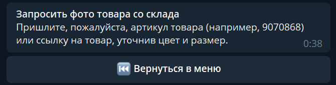
   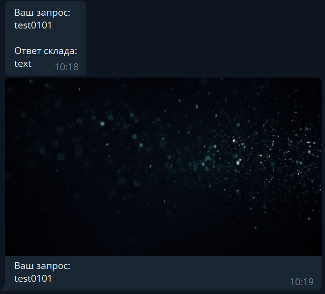

 

#### 8. Создать инцидент/жалобу. Ещё более сложный и интересный способ динамической реализации меню бота, чем в FAQ. 
   Наполнение, поведение состояний, глубина переходов полностью контролируются через админскую панель. 
   Реализовано благодаря `MenuNode` и библиотеке `django-mptt`,
   позволяющей создавать модели, с которыми можно работать как с деревьями.
   Это позволяет делать вложенные меню в боте через админскую панель, 
   при этом на каждом этапе принимать кастомный ввод от пользователя 
   и в конце цепочки полностью передавать все ответы пользователя серверу.
   Также в конце цепочки ответов пользователя через API создавался тикет в Jira на работу с данным инцидентом.
   Вся информация, которую предоставил пользователь, дублируется в тикете.

   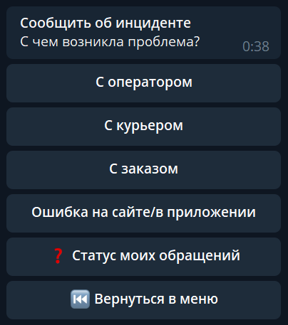
   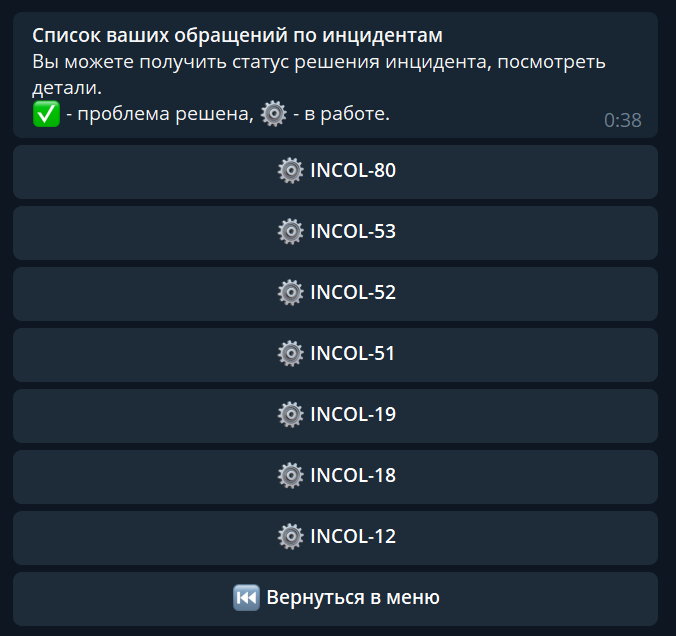
   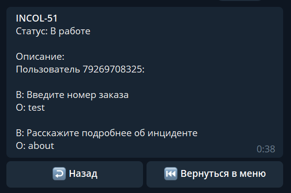

 

#### 9. Выйти из аккаунта.
   Инвалидация токена и возвращение в самое первое меню - меню входа.

---
## Приложение `support`

#### Приложение позволяет хранить и передавать сообщения от клиента в службу поддержки и обратно. Управлять наполнением меню частых вопросов и меню инцидентов.

* Сообщения менеджерам отправлялись в сервис Blinger, который агрегирует сообщения из всех соцсетей и, в том числе, из моего бота.
Ответы от поддержки приходят через Webhook `v1/blinger/webhook/` и отправляются пользователям в боте.

* Как выглядит создание FAQ через админскую панель. 
  Вопрос - это кнопка, которая отображается в меню, а ответ - это текст, 
  который будет отображаться в подменю, после нажатия пользователем на inline-кнопку с вопросом.
  
   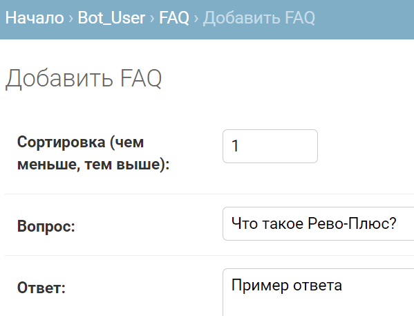

* Как выглядит ветвление меню инцидентов, основанное на использовании моделей как деревьев.

   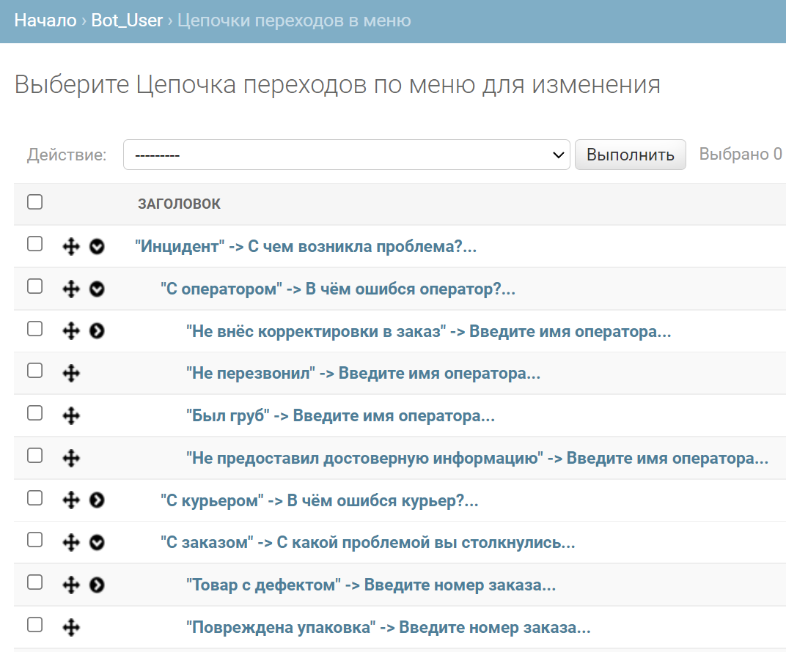
  

